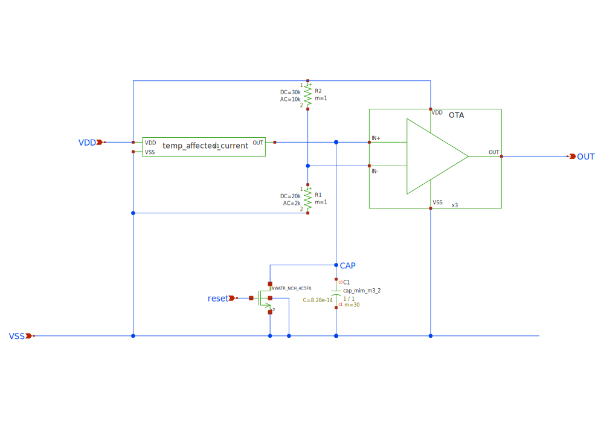
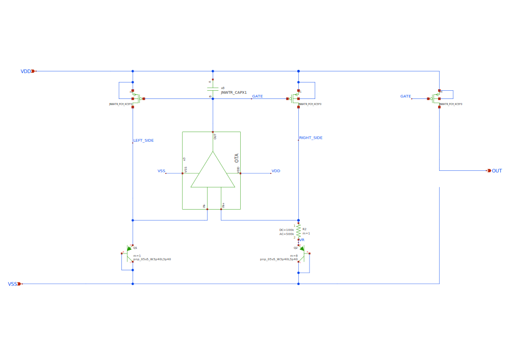
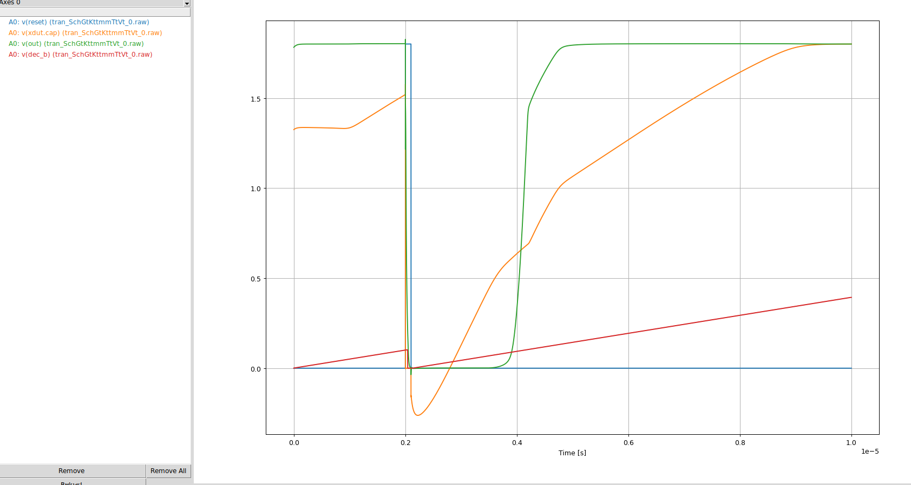
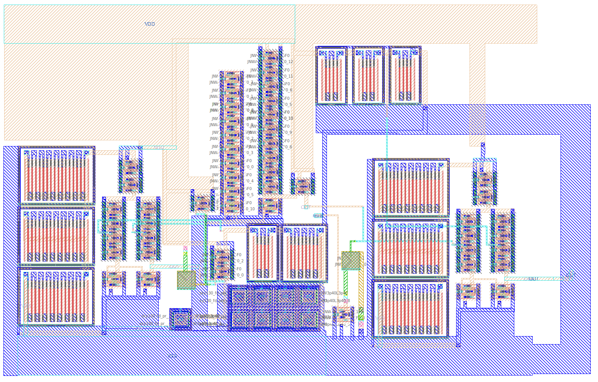
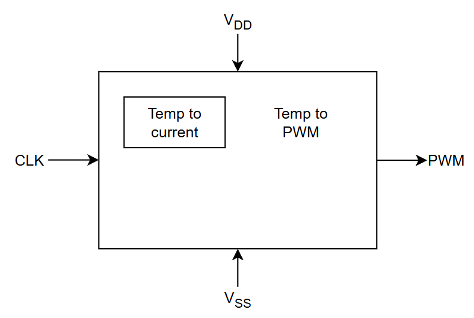
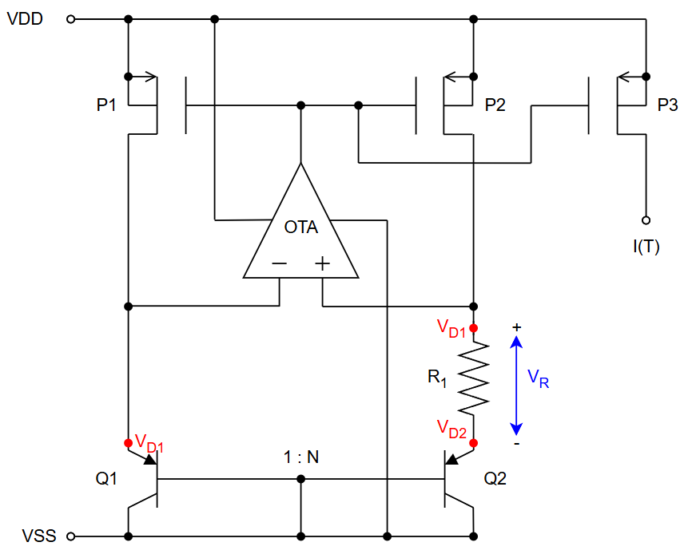
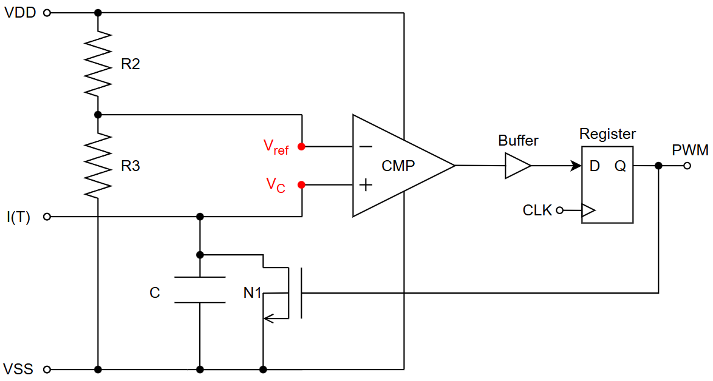
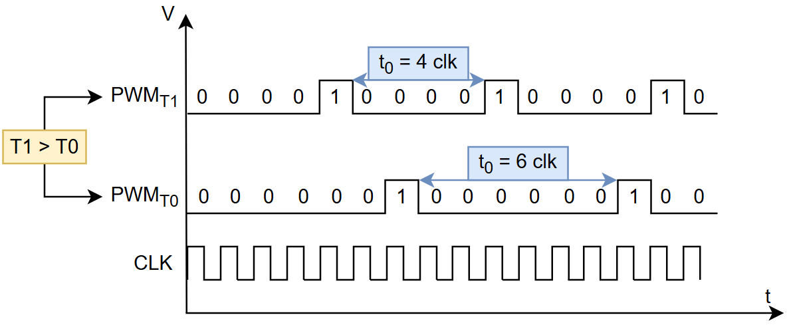
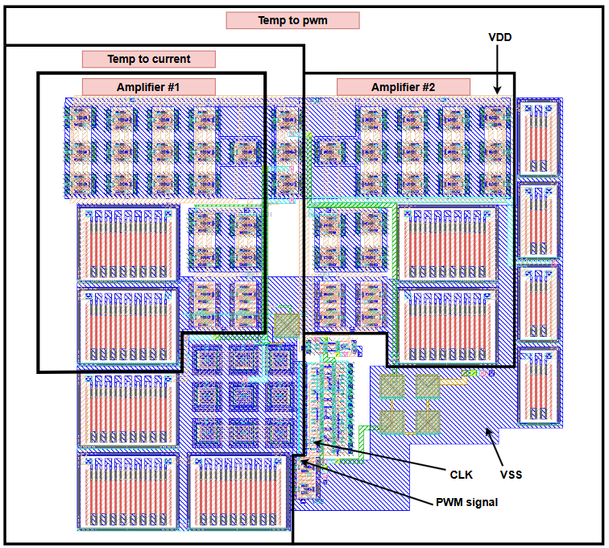

<!---

This file is used to generate your project datasheet. Please fill in the information below and delete any unused
sections.

You can also include images in this folder and reference them in the markdown. Each image must be less than
512 kb in size, and the combined size of all images must be less than 1 MB.
-->

## How it works

JNW-TEMP contains two temperature sensors made by students at NTNU in the course
Advanced Integrated Circuits TFE4188. 

A detailed description by the students can be seen in chapters below. 

## How to test

- GR07: Set the clk to as high as it goes. Monitor uo_out[0], the period will change with temperature
- GR06: Set ui_in[0] high. When you set ui_in[0] low there will be a single pulse on uo_out[2] with a duration 
that is inversly proportional to temperature.

## External hardware

## JNW\_GR06\_SKY130A

The JNW\_GR06\_SKY130A design can be found in ip/jnw\_gr06\_sky130a. For more information, see <https://analogicus.github.io/jnw_gr06_sky130a/>

### Who
Gabin Sbaffi, 
Erik K. Jensen &
Renate Klemetsdal
 

### What
We are making a temperature sensor.

### Why
For the course TTT4188 Advanced Integrated circuits

### How the circuit works

To describe the circuit I want to split it into two different parts.
1) Circuit to generate the temperature dependent current
2) Turning the current into a rising voltage and using it to create a digital output.

### Top level schematic

In this schematic, the PTAT (1) is created inside the block called
temp\_affected\_current. 
The converting to digital happens with the OTA and the capasitor in the middle bottom. 

Nodes to remember: 
V(cap) is at node CAP
V(OUT) is at the node OUT

### 1. Creating the current

 The current is made by using the temperature dependencies of 
 diodes (implemented with bipolar transistors) and the size difference
 between the single diode on the left side and the 8 on the right side. The
 voltage over the left side diode is 
 $V_{DL} = V_T ln\frac{I_D}{I_{L}}$ while the voltage over the diode on the
 right side is: 
 $V_{DR} = V_T ln\frac{I_D}{I_{SR}}$, where $I_D$ is the equal current in both
 branches. 
 This equal current comes from the OTA feedback, which makes the gate voltage for 
 the two PMOS transistors, x2 and x1 . 

 An OTA would force the inputs, V(RIGHT_SIDE) and V(LEFT_SIDE) to be the same, 
 which means that the voltage drop on the left side, over diode $Q1$ is the same as the voltage drop over the resistor $R$ and the 8 diodes $Q2$. 
 This means that $V_R + V_{Q2} = V_{Q1}$ which imples $V_R = V_{Q1} -V_{Q1} = V_T ln\frac{I_D}{I_L} - V_T ln\frac{I_D}{I_R} = V_T ln\frac{I_R}{I_L}$. 
 Since the right side Diode $Q2$ is 8 times larger than the left side diode $Q1$ we know that $I_R \approx 8 \cdot I_L$ which means that $V_R \approx V_T ln(8)$. 
 Knowing the voltage drop over the resistor means we can find the current in the right branch: $I_R = \frac{V_R}{R} = \frac{kT}{q} ln(8)/R$, where T is 
 temperature, meaning we got a current that increases with temperature. 

 
<!--- ################################################################################################################# --->

### 2. Making the current into a digital value.

The current from equation (1) is directed into a capacitor, resulting in a rising voltage. 
At this point, we assume the current is stable, and the voltage across the capacitor is given by:

$V_c = \frac{1}{C} \int_0^t I  dt$

This equation shows that the voltage increases linearly with time. Consequently, if the current is halved, it takes twice as long to reach the same voltage.
In our case, the current varies ish linearly with temperature. This means that at different temperatures, the voltage across 
the capacitor, $V_{cap}$, reaches a ceartain voltage value at different times.
We can find a formula for the time required to increase the voltage to 0.6V, which is the voltage used in this circuit.

To turn this rising voltage into a digital signal, we use a comparator. The idea is to check when the voltage exceeds a certain voltage, this case 0.6V.  
If the voltage across the capacitor, $V_{cap}$, is below 0.6V, the output is 0. if its above 0.6V, the output switches to 1. 
This comparison is done using a comparator, and in this project a OTA is used.

$0.6 = \frac{1}{c} \int_0^t I \Rightarrow 0.6C = I * t \Rightarrow t = 0.6 \frac{C}{I}$

To convert the rising voltage into a digital signal, we send it into the comparator that checks when it is larger than 0.6V. If the voltage across the capacitor, $V_{cap}$, is below 0.6V, the output remains 0. Once it surpasses 0.6V, the output switches to 1. This output is generated using a comparator, and in this design, an OTA is used as an comparator.

After a certain period, which is going to be constant, maybe 20 us, the circuit's reset signal goes high, which shorts the capacitor and resets its voltage to 
$V_C = 0 + \text{charge injection}$
From this point, the voltage starts increasing again, taking a time t  to reach the threshold.  
Before the reset signal goes high, the output remains 1. When the circuit resets, the output switches to 0 and then returns 
to 1 after a certain time t. This time t is proportional to temperature.  
To measure this, we implement a counter—designed in Verilog for this project—that tracks the time from reset until the 
output goes high again. The counter's output then provides a digital value corresponding to the temperature.

In the picture below one can see how it is in the simulator. The capacitor voltage is the orange curve, the red is a counter value, the green the output voltage of the OTA. The blue is the reset signal.

### Layout
Layout of the top level:

On the left is the temperature to current circuit. In the middle/right one can see the capacitor that is 
being charged. On the right is the OTA comparator that creates the output signal. 
VDD is on metal1(orange) and VSS is on locali(Blue).

## JNW\_GR07\_SKY130A

The JNW\_GR07\_SKY130A design can be found in ip/jnw\_gr07\_sky130a. For more information, see <https://analogicus.github.io/jnw_gr07_sky130a/>

### Who

Reidar Arne Eidsvik Nerheim, Pol Batalle Largo and Tord Olsen Sætermo.

### Why

This project is a part of the course "TFE4188 - Advanced Integrated Circuits" at NTNU during the spring of 2025.

### How

We used tools such as xschem, ngspice, and magic.

### Signal interface

| Signal    | Direction | Domain  | Description          |
| :---      | :---:     | :---:   | :---                 |
| VDD       | Input     | VDD_1V8 | Main supply          |
| VSS       | Input     | Ground  |                      |
| CLK       | Input     | Clock   | Clock signal         |
| PWM       | Output    | Digital | Digital output signal proportional to temperature |

### Key parameters

| Parameter           | Min     | Typ             | Max     | Unit  |
| :---                | :---:     | :---:         | :---:   | :---: |
| Technology          |         | Skywater 130 nm |         |       |
| AVDD                | 1.7     | 1.8             | 1.9     | V     |
| Temperature         | -40     | 27              | 120     | C     |

### System description

This is a temperature measurement circuit. It is built up of two blocks:
1. Temp to Current, a circuit that outputs a current proportional to absolute temperature (PTAT)
2. Current to PWM, a circuit that outputs a digital PWM signal proportional to temperature

The system is depicted below

### Temperature to Current, PTAT

The PTAT circuit can be found in "**design/JNW_GR07_SKY130A/temp_to_current.sch**", and is shown
in the figure below. 

The circuit exploits the temperature (T) dependency and size difference (N)
of diode 1 and diode 2 to create a current I(T) dependent on temperature. The voltage over diode 1
is $V_{D1} = V_T ln\frac{I_D}{I_{S1}}$, and the voltage over diode 2 is $V_{D2} = V_T ln\frac{I_D}{I_{S2}}$.
Assuming that the opamp is ideal, the voltage on it's negative input is set equal to it's positive input,
meaning $V_{D1} = V^- = V^+$. This creates a voltage drop accross the resistor $R_1$ of $V_{R_1} = V_{D1} - V_{D2} = V_T ln\frac{I_{S2}}{I_{S1}}$.
Since diode 2 is N times larger than diode 1, we can assume $I_{S2} \approx N I_{S1}$, meaning that $V_{R_1}$ can be simplified to $V_{R_1} \approx V_T ln(N)$.
The current through $R_1$ is then $I_{R_1} = \frac{V_{R_1}}{R_1} = \frac{V_t}{R_1} ln (N)$.
Since $V_T = \frac{kT}{q}$, we get a current proportional to temperature: $I_{R_1}(T) = \frac{kT}{qR_1} ln(N)$. This current is copied using a current mirror,
creating $I(T)$ and used as an output.

**Note**: Diode 1 and diode 2 are realized by the NPN transistors Q1 and Q2 respectivly.

### Current to PWM

The current to PWM circuit can be found in "**design/JNW_GR07_SKY130A/temp_to_pwm_RA.sch**", and is shown
in the figure below.

The circuit used the input current $I(T)$ to charge a capacitor. The voltage across the capacitor is used as input voltage of the positive
node of a comparator, $V^+ = V_C$. The negative node is connected to a reference voltage $V^- = V_{ref}$, created by a voltage divider consisting of two resistors, $R_2$ and $R_3$.
This gives $V^- = V_{ref}= V_{DD} \frac{R_3}{R_3+R_2}$. The voltage across the capacitor can be approximated as $V_C(t) = V^+ = \int_{0}^{t} \frac{I(T)}{C} \ dt \approx \frac{tI(T)}{C}$, assuming that
1. $V_C(t=0) = 0$, the voltage starts at 0 when time is 0.
2. $\frac{\partial T}{\partial t} = 0$, the temperature is not dependent on time.

The output of the comparator is set to high at time $t_0$, when $V^- = V^+(t_0)$. Using the previous equations this can be written as $V_{ref} = \frac{t_0I(T)}{C}$.
The time $t_0$ is thus given by $t_0 = \frac{V_{ref}C}{I(t)}$. The output of the comparator is buffered, then fed into a clocked register. The output of the register
is the PWM signal, and is simultaneously used to reset the circuit. The reset is done by discharging the capacitor using an nmos, N1, connected to ground.

It can be shown using previous formulas (found in section "**Temp to Current, PTAT**"), that $\frac{\partial I(T)}{\partial T} > 0$,
meaning that a higher T results in lower $t_0$. This means that higher temperatures results in a PWM signal with higher mean voltage (RMS). This is depicted
the figure below, where temperature $T1 > T0$.

### Layout of PWM circuit 

The layout of the PWM circuit can be found in "**design/JNW_GR07_SKY130A/JNW_GR07.mag**", 
and is depicted below 

